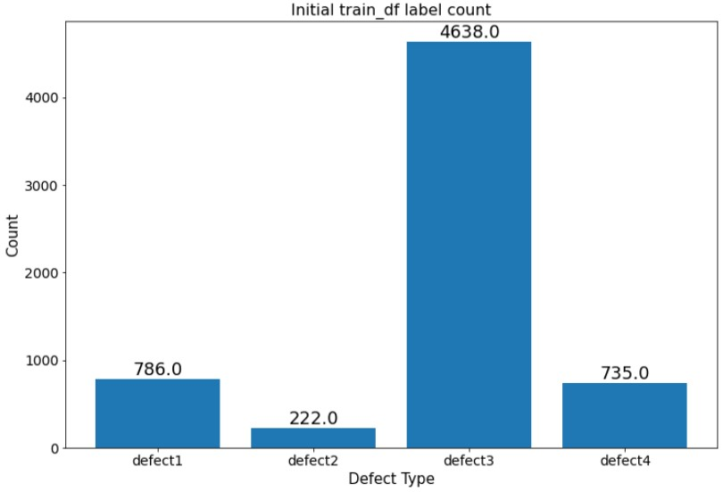

# Steel-defect-detector_segmentation

Source from Kaggle: [Severstal: Steel Defect Detection](https://www.kaggle.com/c/severstal-steel-defect-detection)

## Dataset

- Four defects type in dataset. The example of each defect type is shown as below.

  - Defect 1.  
  

  - Defect 2.  
  

  - Defect 3.  
  

  - Defect 4.  
  

- The count of each defect are shown as below. This dataset is imbalanced.  
  

## License
[MIT](https://choosealicense.com/licenses/mit/)
