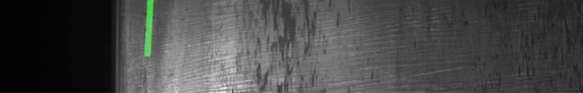
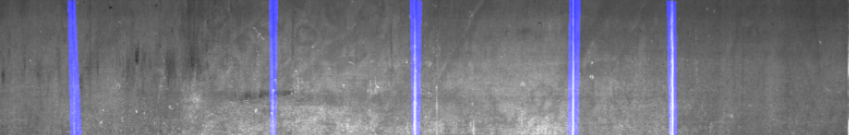
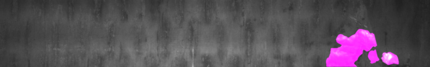
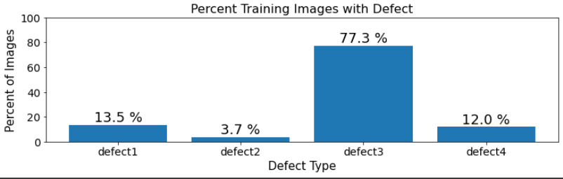

# Steel-defect-detector_segmentation


Source from Kaggle: [Severstal: Steel Defect Detection](https://www.kaggle.com/c/severstal-steel-defect-detection)

## Requirements

1) keras_applications
2) image-classifiers
3) efficientnet
4) segmentation_models
- Source from: https://github.com/qubvel/segmentation_models

```bash
pip install -r requirements.txt
```

## Introduction

- Four defects type in dataset. The image of each defect type is shown as below.

  - Defect 1.  

  - Defect 2.  

  - Defect 3.  

  - Defect 4.  


- The percentage of each defect are shown as below. The percentage defect 3 is more than half of dataset. 


## Model
- ResUnet


## Contributing
Pull requests are welcome. For major changes, please open an issue first to discuss what you would like to change.

Please make sure to update tests as appropriate.

## License
[MIT](https://choosealicense.com/licenses/mit/)
