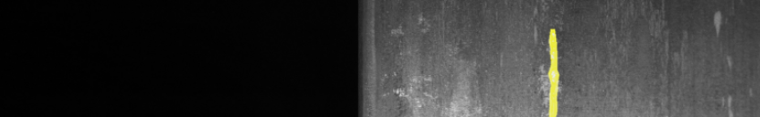
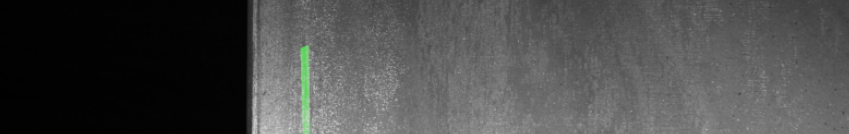
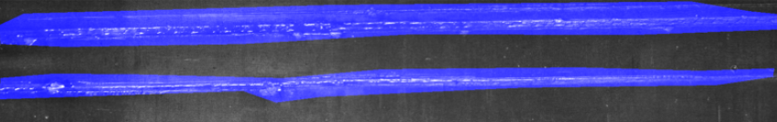
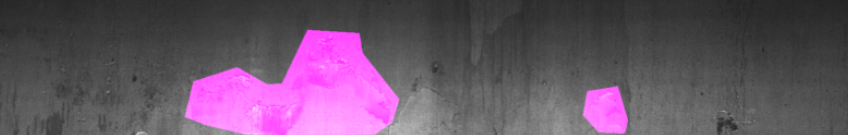
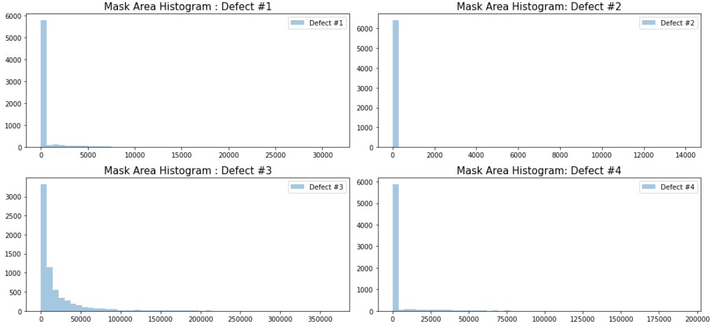
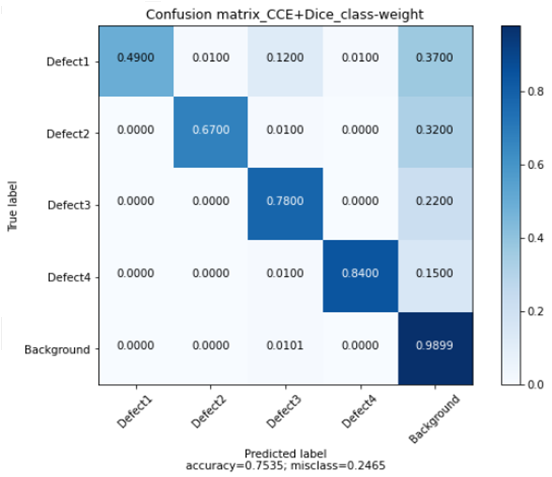

# Steel-defect-detector_segmentation


Source from Kaggle: [Severstal: Steel Defect Detection](https://www.kaggle.com/c/severstal-steel-defect-detection)

## Requirements

1) keras_applications
2) image-classifiers
3) efficientnet
4) segmentation_models
- Source from: https://github.com/qubvel/segmentation_models

```bash
pip install -r requirements.txt
```

## Introduction

- Four defects type in dataset. The example of each defect type is shown as below.

  - Defect 1.  
  

  - Defect 2.  
  

  - Defect 3.  
  

  - Defect 4.  
  

- The percentage of each defect are shown as below. The percentage defect 3 is more than half of dataset. 


- Analyze mask area sizes  


- Plot images with large mask areas(>200000 pixel) picked by random index.  Defect 3 masks seem to contain a lot of empty space without any defects.  


## Define trainng model
- ResUnet (Residual U-Net)


- Loss function
  - Add class_weights for each class to balance dataset.
  - ``Catagorical_cross_entropy`` + ``Dice loss``
  - ``Catagorical_cross_entropy`` 
- Optimizer
  - ``Adam``
   
## Evaluation
 - Create confusion matrix for each pixel. It is shown as below. 
 - The precision of model using CCE is better than using CCE+Dice in this case.
 - 
|CCE|CCE+Dice|
|:--:|:--:|
|||

## License
[MIT](https://choosealicense.com/licenses/mit/)
