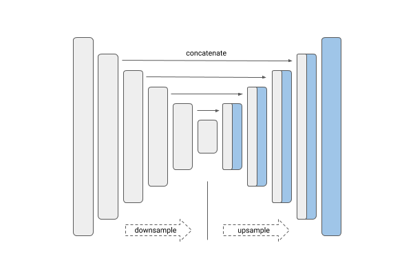

# Steel-defect-detector_segmentation


Source from Kaggle: [Severstal: Steel Defect Detection](https://www.kaggle.com/c/severstal-steel-defect-detection)

## Requirements

1) keras_applications
2) image-classifiers
3) efficientnet
4) segmentation_models
- Source from: https://github.com/qubvel/segmentation_models

```bash
pip install -r requirements.txt
```

## Dataset

- Four defects type in dataset. The example of each defect type is shown as below.

  - Defect 1.  
  

  - Defect 2.  
  

  - Defect 3.  
  

  - Defect 4.  
  

- The count of each defect are shown as below. This dataset is imbalanced.  
  

## Summary
- Trying two model:

|[Unet](https://arxiv.org/abs/1505.04597)|[Feature Pyramid Network (FPN)](http://presentations.cocodataset.org/COCO17-Stuff-FAIR.pdf)|
|:--:|:--:|
|||

- Using ``EfficientNet`` for encoder to extract feature.
- Activation function: ``Sigmoid``
- Add class_weights for each class to balance dataset.
- Loss function: ``binary_cross_entropy`` + ``Dice loss``  
- Optimizer: ``Adam``

## Evaluation
 - Create confusion matrix for each pixel. It is shown as below. 
 - The precision of model using CCE is better than using CCE+Dice in this case.
 - 
|CCE|CCE+Dice|
|:--:|:--:|
|||

## License
[MIT](https://choosealicense.com/licenses/mit/)
